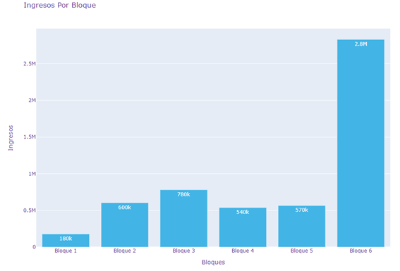
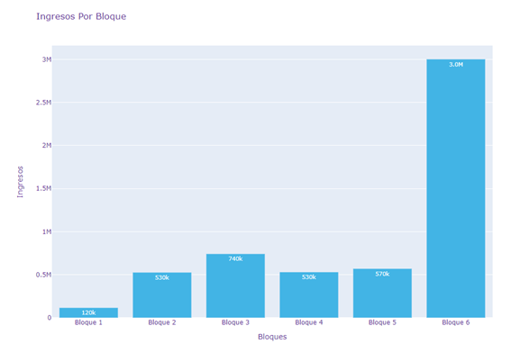

- Al ser consumo de Agua, la demanda es mas inelastica
- Como se ha visto el diseño de tarifas por bloques nos permite segmentar de mejor manera el consumo de la población [[#green]]==evitando caer en desperdicios==, en este caso al diseñar tarifas para un servicio tan importante y escaso como es el agua es evidente que una tarifación en bloques crecientes genera más eficiencia dado que se castiga los excesos de consumo.
- Por otro lado se ha podido evidenciar, que al proponer diversos precios para cada método de tarifación  por bloque, la empresa que presta el servicio de agua puede cubrir sus costos totales.
- Así como también se recalca la importancia de la estimación de la demanda para poder generar los mismos bloques, y que dichos bloques no dejen se tornen inaccesibles para los consumidores
-
- A través de la regulación económica se busca generar eficiencia en la asignación de recursos medida a través del bienestar social que se genera, sin embargo, en este caso sería erróneo la comparación entre tarifas crecientes con decrecientes, dado que en el primer caso estaríamos desincentivando en el consumo y en segundo incentivando al consumo, por lo que para establecer la tarifa óptima entre los escenarios planteados se tomará en consideración únicamente tarifas crecientes y tarifas crecientes con cargo fijo, dando como resultado que la tarifa creciente que este último genera mayor bienestar social.
-
- Por ultimo cabe la recomendación ante los escenarios planteados,  que la mejor forma de tarifación por bloques para el sistema de servicio de Agua potable, es el de Tarifación en Bloque Creciente sin Cargo fijo. Esta recomendación se lleva a acabo ya que en nuestro trabajo todos los precios y bloques generados cubren los costos fijos de la empresa, sin embargo este modelo de tarifación creciente presenta un precio menor para aquellos de menor consumo, y un precio mayor a medida que los el consumo aumenta, esto es de vital importancia al ser el agua potable un servicio básico, a esto se debe tomar en cuenta que
-
- 
- 
-