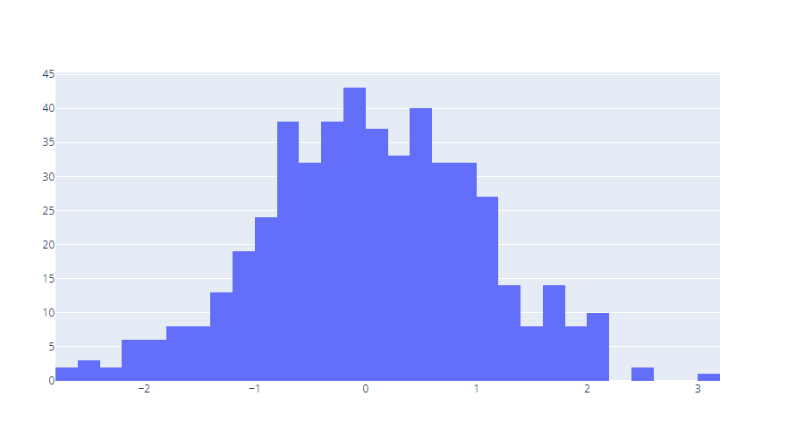

icon:: 💻

- Archivos Locales
  collapsed:: true
	- RAR
	  collapsed:: true
		- Extraer Archivos, en la carpeta donde se encuentre el archivo principal,  de un archivo comprimido RAR:
		  collapsed:: true
			- Primero instalamos la librería `patool`
			- ``` Python
			  pip install patool
			  ```
			- ``` Python
			  import patoolib
			  # Con `outdir` podemos especificar la dirección de la carpeta en la cual queremos 
			  # poner los archvos descomprimidos
			  patoolib.extract_archive("Test.rar", outdir="/some/dir")
			  ```
			- ref
			  collapsed:: true
				- https://stackoverflow.com/questions/43527641/extract-single-file-from-rar-archive-with-rarfile-in-python
	- Carpetas
	  collapsed:: true
		- Como mostrar archivos dentro de una carpeta
			- Esto muestra los archivos existentes dentro de la misma carpeta en la cual se encuentra el proyecto
			- ``` Python
			  import os
			  arr = os.listdir()
			  ```
			- Especificamos la dirección de la carpeta
			- ``` python
			  import os
			  arr = os.listdir('c:\\files')
			  ```
			- Ref
			  collapsed:: true
				- https://stackoverflow.com/questions/3207219/how-do-i-list-all-files-of-a-directory
- Listas (arrays)
  collapsed:: true
	- Selecionar
		- Desde el Segundo Valor y sin Incluir el Ultimo
		- ``` python
		  my_list = my_list[1:-1]
		  ```
		- ref
		  collapsed:: true
			- https://stackoverflow.com/questions/11338143/how-to-remove-the-first-and-last-item-in-a-list
- Gráficos
  collapsed:: true
	- [[Plotly]]
		- Histograma Simple con Una variable - Grafico de Barras simple con una Variable
		  collapsed:: true
			- ``` python
			  import plotly.graph_objects as go
			  
			  import numpy as np
			  np.random.seed(1)
			  
			  x = np.random.randn(500)
			  
			  fig = go.Figure(data=[go.Histogram(x=x)])
			  fig.show()
			  ```
			- 
			- ref
			  collapsed:: true
				- https://plotly.com/python/histograms/
		- Múltiples Graficas en una Sola
		  collapsed:: true
			- ``` python
			  from plotly.subplots import make_subplots
			  import plotly.graph_objects as go
			  
			  fig = make_subplots(rows=1, cols=2)
			  
			  fig.add_trace(
			      go.Scatter(x=[1, 2, 3], y=[4, 5, 6]),
			      row=1, col=1
			  )
			  
			  fig.add_trace(
			      go.Scatter(x=[20, 30, 40], y=[50, 60, 70]),
			      row=1, col=2
			  )
			  
			  fig.update_layout(height=600, width=800, title_text="Side By Side Subplots")
			  fig.show()
			  ```
			- 
			- ref
			  collapsed:: true
				- https://plotly.com/python/subplots/
		- Update Layout
		  collapsed:: true
			- Ajustar Axix. Ajustar Ejex
				- ``` python
				  
				  ```
				- Ref
					- https://plotly.com/python/axes/
			- Rellenar area cp color -Fill Area
			  collapsed:: true
				- ``` python
				  
				  ```
				- ref
					- https://plotly.com/python/filled-area-plots/
			- Cambiar Color y Transparencia de Area de Color - Fill Area
			  collapsed:: true
				- ``` python
				  fillcolor='rgba(255, 0, 0, 0.1)',
				  ```
				- ref
					- https://community.plotly.com/t/plotly-python-fill-control-opacity-of-filled-area/18445
		- Fill Area
		  collapsed:: true
			- https://plotly.com/python/filled-area-plots/a
		- [Text and annotations in Python](https://plotly.com/python/text-and-annotations/)
		- [Line charts in Python](https://plotly.com/python/line-charts/)
		  collapsed:: true
			- Cambiar color de Línea y  tipo de Línea
		- [Bar charts in Python](https://plotly.com/python/bar-charts/)
		  collapsed:: true
			- Cambiar color de barras
			  collapsed:: true
				- 
		- [Legends in Python](https://plotly.com/python/legend/)
		  collapsed:: true
			- Cambiar de posición las leyendas
- Factor de Expansión en Python
  collapsed:: true
	- ``` python
	  import pandas as pd
	  from pandas_weighting import weight
	  
	  pd.Series.weight = weight
	  pd.DataFrame.weight = weight
	  
	  df = pd.DataFrame({
	      'val': [1, 2, 3, 4, 5, 6],
	      'weights': [3, 2, 1, 1, 0, None],
	  })
	  
	  # mean 3.5 =(1+2+3+4+5+6)/6
	  df.val.mean()
	  
	  # weighted mean 2.0 =(3*1+2*2+1*3+1*4)/(3+2+1+1)
	  df.val.weight(df.weights).mean()
	  ```
	- ref
		- https://pypi.org/project/pandas-weighting/#:~:text=pandas%2Dweighting%20enables%20general%20level,defined%20in%20'weight'%20column.
		- https://datagy.io/pandas-weighted-average/
- IDES
  collapsed:: true
	- [[Jupyter Notebook]]
	  collapsed:: true
		- {{embed ((62af393f-3e18-4210-ab57-6f60968563b7))}}
	- [[Jupyter Lab]]
		- Cambiar Ancho de celdas o bloques de codigo
		- id:: 62af393f-3e18-4210-ab57-6f60968563b7
		  ``` python
		  from IPython.core.display import display, HTML
		  display(HTML("<style>.container { width:100% !important; }</style>"))
		  ```
		- ref
			- https://www.codegrepper.com/code-examples/python/expand+jupyter+notebook+width
- Bases de Datos
  collapsed:: true
	- Pandas
	  collapsed:: true
		- Convertir archivos
		  collapsed:: true
			- De Stata(.dta) a Python
			- ``` Python
			  df = pd.read_stata('animals.dta')
			  ```
			- ref
			  collapsed:: true
				- https://pandas.pydata.org/docs/reference/api/pandas.read_stata.html
		- Importar base de Datos [[Stata]] (.dta) a Pandas
		  collapsed:: true
			- ``` python
			  df = pd.read_stata('animals.dta')  
			  ```
			- ref
			  collapsed:: true
				- https://pandas.pydata.org/docs/reference/api/pandas.read_stata.html
		- Filtrar Base de Datos
		  collapsed:: true
			- Usando Condicionales
				- ``` python
				  df.loc[df['Age'] < 30, 'Age Category'] = 'Under 30'
				  ```
- Web Scrsping
  collapsed:: true
	- Playwright
		- Abrir navegador sin modo incognito
		  collapsed:: true
			- wxhkjs
			- ref
			  collapsed:: true
				- https://playwright.dev/python/docs/api/class-browsertype#browser-type-launch-persistent-context
		- Abrir en navegador con otro navegador como brave o chrome o firefox
		  collapsed:: true
			- wxhkjs
			- ref
			  collapsed:: true
				- https://playwright.dev/python/docs/api/class-browsertype#browser-type-launch-persistent-context
- Proyecto por revisar
  collapsed:: true
	- https://github.com/Python-World/python-mini-projects
- Calculo
	- Derivadas
		-